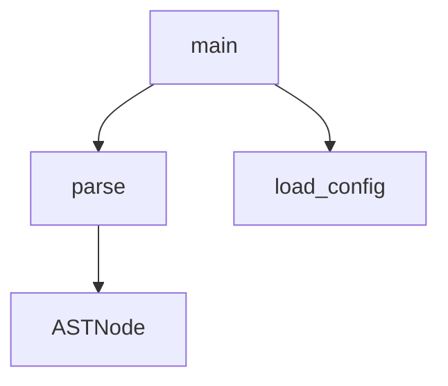

# CodeViz

> **Zero-Drift Architecture Documentation.**
> Parse your source code → generate a Mermaid diagram → inject it into your README. Automatically. Every commit.

[](.)
[](LICENSE)
[](.)
[](.)

---

## The Problem

Architecture diagrams rot. The moment a developer merges a Pull Request, any Mermaid flowchart in your README is already outdated. Keeping it accurate requires manual work no one does.

## The Solution

CodeViz treats your **source code as the source of truth** for documentation. It:
1. Parses your code into an AST via [Tree-sitter](https://tree-sitter.github.io/tree-sitter/)
2. Extracts relationships (imports, calls, inheritance) into a language-agnostic graph
3. Renders a Mermaid diagram and injects it between sentinel tags in your markdown

The diagram updates itself. Every commit. No manual effort.

---

## Quickstart

Get started in 30 seconds:

```bash
# 1. Install CodeViz
cargo install codeviz

# 2. Add sentinel tags to your README.md
echo "<!-- CODEVIZ_START -->" >> README.md
echo "<!-- CODEVIZ_END -->" >> README.md

# 3. Generate the diagram!
codeviz --path ./src --output README.md
```

### Example Output
When CodeViz runs, it injects a live graph between your tags. It looks like this:



---

## Why Not X? (Differentiation)

How does CodeViz compare to existing architecture tools?
- **vs. dependency-cruiser**: `dependency-cruiser` is fantastic, but it only works for JavaScript/TypeScript ecosystems. CodeViz uses a **language-agnostic IR graph**, meaning it works the exact same way for Python, Rust, Go, Java, and TS.
- **vs. Structurizr / C4 Model**: Structurizr requires you to manually write a custom DSL to define your architecture. CodeViz **auto-parses** your actual source code. Your code is the DSL.

---

## How It Works

Place sentinel tags anywhere in your markdown:

```markdown
<!-- CODEVIZ_START -->
<!-- CODEVIZ_END -->
```

CodeViz **only touches content between those tags** — everything else in your file is preserved.

---

## Three Distribution Channels, One Core

CodeViz is built with a **Core + Adapter** architecture in Rust, producing three artifacts from a single codebase:

```text
┌────────────────────────────────────────────────────────┐
│                      CodeViz Core                       │
│     Source Code ──► AST ──► IR Graph ──► Mermaid       │
└────────────────────────────────────────────────────────┘
          ▲                  ▲                  ▲
          │                  │                  │
┌──────────────────┐ ┌────────────────┐ ┌────────────────────┐
│  CLI Adapter     │ │  WASM Adapter  │ │  MCP Adapter       │
│  • File I/O      │ │  • JS interop  │ │  • JSON-RPC/stdio  │
│  • pre-commit    │ │  • Virtual FS  │ │  • AI tool calls   │
│  • GitHub CI     │ │  • Zero-upload │ │  • Graph queries   │
└──────────────────┘ └────────────────┘ └────────────────────┘
```

### CLI — For Developers & CI/CD
Run manually or plug into pre-commit hooks to auto-update diagrams on every commit.

### WASM Module — For Architects & Browser Tools
Drop a repository folder directly into our browser-based CodeViz Playground. The WASM engine generates the diagram **locally** — no code ever touches a server.

### MCP Server — For AI Assistants
CodeViz runs as an [MCP (Model Context Protocol)](https://modelcontextprotocol.io/) server, exposing your codebase's graph to any MCP-compatible AI assistant (Claude, Cursor, Continue, etc.).

**Why use an MCP Graph Tool?** 
Providing an AI agent with a structured graph via MCP costs virtually zero context tokens, whereas forcing an agent to blindly read 100 source files will blow out its context window and introduce hallucination.

| MCP Tool | Description | Example AI Use Case |
|---|---|---|
| `get_module_graph` | Full import/dependency graph | "How is this codebase structured?" |
| `get_callers(fn)` | Who calls this function? | Impact analysis before refactoring |
| `get_callees(fn)` | What does this function call? | Trace an execution path |
| `find_entry_points` | Main entry points of the project | Onboarding to a new repo |
| `explain_path(a, b)` | How does module A depend on B? | Debug unexpected coupling |

---

## Product Roadmap

We are currently building out the CodeViz SaaS application (Next.js + SurrealDB) and expanding our ecosystem.

### MVP v1 — "Make It Viral" (Core OSS)
- [x] **Core Parsers**: Python, TS, Go, Rust, Java, Kotlin.
- [x] **Interactive Code Playground**: Live WASM parser sandbox on the web UI.
- [x] **SurrealDB Backend**: Real-time graph storage and authentication.
- [ ] **VS Code Extension**: Sidebar graph panel, status bar, auto-refresh on save.
- [ ] **MCP Debugging Tools**: `summarize_architecture`, `trace_call_path`, etc.
- [ ] **Interactive Call Path Explorer**: Animated BFS graph traversal in the Web UI.

### MVP v2 — "Make It Sticky" (Team Features)
- [ ] **Architecture Drift Alerts**: PR comments + Slack when architecture regresses.
- [ ] **"Onboard Me"**: Auto-generated architecture walkthrough documents.
- [ ] **Team Workspaces**: RBAC and multi-user graph sharing.

### MVP v3 — "Make It Pay" (Enterprise Features)
- [ ] **OpenTelemetry Trace Overlay**: Import OTEL traces to see live execution paths.
- [ ] **Multi-Repo Cross-Service Graph**: Visualize microservice dependencies.
- [ ] **Universal Parser**: (Experimental) Query-Based parsing via TOML files for 40+ languages.
- [ ] **SBOM Export (CycloneDX / SPDX)**: Compliance requirement for regulated industries.

---

## Configuration (Optional)

```toml
# codeviz.toml
[graph]
max_depth = 3
diagram_type = "flowchart"   # flowchart | classDiagram | graph
include = ["src/**"]
exclude = ["**/tests/**", "**/vendor/**"]
```

---

## Architecture Decision: Why Rust?

- **Tree-sitter** has first-class Rust bindings (`tree-sitter` crate).
- **`wasm-pack`** compiles Rust to WASM with minimal friction — the same binary targets both CLI and browser.
- **Performance** — parsing large codebases must be fast enough for pre-commit hooks (< 500ms target).
- **Correctness** — the IR graph model is complex enough to benefit from Rust's type system.

---

## License (Dual License Model)

CodeViz operates on an Open-Core model to ensure the community always has access to the parsing engine, while protecting the commercial SaaS offering:

- **Core Engine & CLI** (`codeviz-core`, `codeviz-cli`, `codeviz-wasm`, `codeviz-mcp`): **MIT License**. Free forever.
- **CodeViz Cloud SaaS** (`codeviz-web`): **Proprietary Commercial License**. All rights reserved. You may view the source for educational purposes, but you may not host, distribute, or offer a competing commercial SaaS offering.
