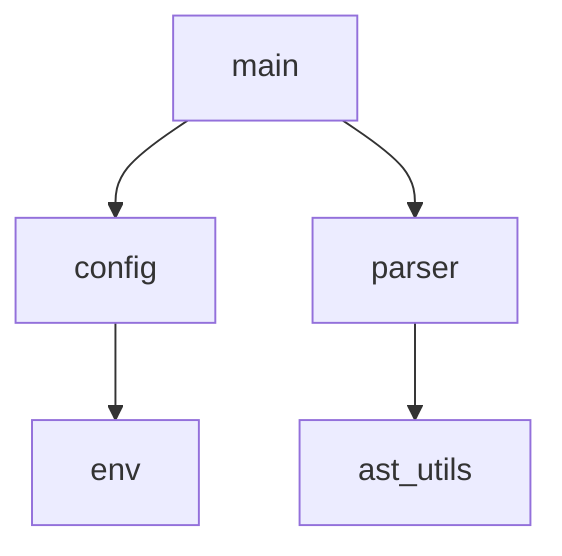

# CodeViz

> **Zero-Drift Architecture Documentation.**
> Parse your source code → generate a Mermaid diagram → inject it into your README. Automatically. Every commit.

[](.)
[](LICENSE)
[](.)
[](.)

---

## The Problem

Architecture diagrams rot. The moment a developer merges a Pull Request, any Mermaid flowchart in your README is already outdated. Keeping it accurate requires manual work no one does.

## The Solution

CodeViz treats your **source code as the source of truth** for documentation. It:
1. Parses your code into an AST via [Tree-sitter](https://tree-sitter.github.io/tree-sitter/)
2. Extracts relationships (imports, calls, inheritance) into a language-agnostic graph
3. Renders a Mermaid diagram and injects it between sentinel tags in your markdown

The diagram updates itself. Every commit. No manual effort.

---

## How It Works

Place sentinel tags anywhere in your markdown:

```markdown
<!-- CODEVIZ_START -->
<!-- CODEVIZ_END -->
```

Run CodeViz (or let CI run it), and the diagram appears automatically:

```markdown
<!-- CODEVIZ_START -->

<!-- CODEVIZ_END -->
```

CodeViz **only touches content between those tags** — everything else in your file is preserved.

---

## Three Distribution Channels, One Core

CodeViz is built with a **Core + Adapter** architecture in Rust, producing three artifacts from a single codebase:

```
┌────────────────────────────────────────────────────────┐
│                      CodeViz Core                       │
│     Source Code ──► AST ──► IR Graph ──► Mermaid       │
└────────────────────────────────────────────────────────┘
          ▲                  ▲                  ▲
          │                  │                  │
┌──────────────────┐ ┌────────────────┐ ┌────────────────────┐
│  CLI Adapter     │ │  WASM Adapter  │ │  MCP Adapter       │
│  • File I/O      │ │  • JS interop  │ │  • JSON-RPC/stdio  │
│  • pre-commit    │ │  • Virtual FS  │ │  • AI tool calls   │
│  • GitHub CI     │ │  • Zero-upload │ │  • Graph queries   │
└──────────────────┘ └────────────────┘ └────────────────────┘
```

### CLI — For Developers & CI/CD

```bash
# Run manually
codeviz --path ./src --output README.md

# Or plug into pre-commit (auto-updates diagram on every commit)
# .pre-commit-config.yaml:
repos:
  - repo: local
    hooks:
      - id: codeviz
        name: Update architecture diagram
        entry: codeviz --path ./src --output README.md
        language: system
        pass_filenames: false
```

### WASM Module — For Architects & Browser Tools

Drop a repository folder directly into a browser-based tool. The WASM engine generates the diagram **locally** — no code ever touches a server. Built for integration with tools like LocalMind DevTools.

### MCP Server — For AI Assistants

CodeViz can run as an [MCP (Model Context Protocol)](https://modelcontextprotocol.io/) server, exposing your codebase's graph as structured tool calls to any MCP-compatible AI assistant (Claude, Cursor, Continue, etc.).

```bash
# Start the MCP server (stdio transport — works with any MCP client)
codeviz serve --mcp

# Or over HTTP/SSE for remote tools
codeviz serve --mcp --port 8080
```

AI assistants get instant, structured access to your code's architecture without reading hundreds of files:

| MCP Tool | Description | Example AI Use Case |
|---|---|---|
| `get_module_graph` | Full import/dependency graph | "How is this codebase structured?" |
| `get_callers(fn)` | Who calls this function? | Impact analysis before refactoring |
| `get_callees(fn)` | What does this function call? | Trace an execution path |
| `get_class_hierarchy` | Full inheritance tree | Understand OOP relationships |
| `find_entry_points` | Main entry points of the project | Onboarding to a new repo |
| `explain_path(a, b)` | How does module A depend on B? | Debug unexpected coupling |

This turns CodeViz from a **diagram generator** into an **AI-native code intelligence layer**. The Mermaid output is just one rendering — the real product is the graph.

---

## Language Support Roadmap

CodeViz adds languages incrementally, prioritizing depth of support over breadth.

| Phase | Milestone | Status | Notes |
|-------|-----------|--------|-------|
| **V0.1** | Python 🐍 | ✅ Done | Imports, classes, async functions |
| **V0.2** | TypeScript / JavaScript 🟦 | ✅ Done | ESM + CJS, interfaces, arrow functions + WASM build |
| **V0.3** | MCP Server 🤖 | ✅ Done | 6 graph query tools over stdio JSON-RPC |
| **V0.4** | Go 🐹 & Rust 🦀 | ✅ Done | Imports, struct embedding, traits, crate graph |
| **V0.5** | Java / Kotlin ☕ | ✅ Done | Enterprise codebases, annotations |
| **V1.0** | Universal Parser 🌐 | ✅ Done | Query-Based parsing via TOML files for 40+ languages |
| **V2.0** | Advanced Code Analysis 🧠 | 📋 Planned | Circular Deps, Unused Modules, PageRank, Health Scores |

Each language phase ships with: a test suite against real-world repos, documented edge cases, and a changelog entry.

---

## Configuration (V1.0)

```toml
# codeviz.toml
[graph]
max_depth = 3
diagram_type = "flowchart"   # flowchart | classDiagram | graph
include = ["src/**"]
exclude = ["**/tests/**", "**/vendor/**"]

[languages]
enabled = ["python", "typescript"]
```

---

## Features

- **🔒 Zero-Cloud Parsing** — No proprietary code ever leaves your device (especially in WASM mode)
- **🌳 Tree-sitter Powered** — Incremental, error-tolerant parsing across languages
- **🔗 Language-Agnostic IR** — Single internal graph model; adding a new language is a new adapter, not a rewrite
- **✂️ Safe Injection** — Sentinel tags protect your existing documentation
- **⚡ CI-Native** — Single binary, no runtime dependencies, fast enough for pre-commit hooks
- **🤖 MCP Server** — Expose your codebase's graph as structured tool calls to any AI assistant

---

## Architecture Decision: Why Rust?

- **Tree-sitter** has first-class Rust bindings (`tree-sitter` crate)
- **`wasm-pack`** compiles Rust to WASM with minimal friction — the same binary targets both CLI and browser
- **Performance** — parsing large codebases must be fast enough for pre-commit hooks (< 500ms target)
- **Correctness** — the IR graph model is complex enough to benefit from Rust's type system

---

## Product Roadmap

We are currently building out the CodeViz SaaS application (Next.js + SurrealDB) and expanding our ecosystem.

### MVP v1 — "Make It Viral" (Core OSS)
- [x] **Core Parsers**: Python, TS, Go, Rust, Java, Kotlin.
- [x] **Interactive Code Playground**: Live WASM parser sandbox on the web UI.
- [x] **SurrealDB Backend**: Real-time graph storage and authentication.
- [ ] **VS Code Extension**: Sidebar graph panel, status bar, auto-refresh on save.
- [ ] **MCP Debugging Tools**: `summarize_architecture`, `trace_call_path`, etc.
- [ ] **Interactive Call Path Explorer**: Animated BFS graph traversal in the Web UI.

### MVP v2 — "Make It Sticky" (Team Features)
- [ ] **Architecture Drift Alerts**: PR comments + Slack when architecture regresses.
- [ ] **"Onboard Me"**: Auto-generated architecture walkthrough documents.
- [ ] **Team Workspaces**: RBAC and multi-user graph sharing.

### MVP v3 — "Make It Pay" (Enterprise Features)
- [ ] **OpenTelemetry Trace Overlay**: Import OTEL traces to see live execution paths.
- [ ] **Multi-Repo Cross-Service Graph**: Visualize microservice dependencies.
- [ ] **SBOM Export (CycloneDX / SPDX)**: Compliance requirement for regulated industries.

---

## Contributing

Contributions welcome — especially new language adapters. Each adapter is a self-contained Rust module implementing the `LanguageParser` trait. See `CONTRIBUTING.md` (coming soon).

---

## License

MIT
