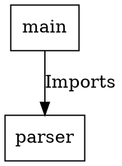

# Spec: Export Formats (`codeviz export`)

## Purpose
Export the raw CodeGraph in alternative formats for power users and downstream tooling.

---

## CLI
```
codeviz export --path <dir> --format json|dot [--output <file>]
```
If `--output` is omitted, writes to stdout.

---

## JSON Format
Full `CodeGraph` struct serialized as JSON (stable format — matches MCP tool responses):
```json
{
  "nodes": [...],
  "edges": [...],
  "meta": { "language": "python", "source_root": "...", "generated_at": "..." }
}
```

## DOT Format (Graphviz)

Node shapes:
- `Function` → `ellipse`
- `Class` → `box`
- `Interface` → `diamond`
- `Module`/`File` → `folder`

---

## Acceptance Criteria
- `codeviz export --format json` output is valid JSON parseable by `serde_json`.
- `codeviz export --format dot` output is valid Graphviz DOT parseable by `dot -Tsvg`.
- Both formats include all nodes and edges (no truncation).
- `--output -` writes to stdout (for piping: `codeviz export --format dot | dot -Tsvg > arch.svg`).
